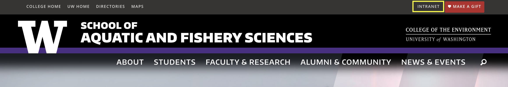
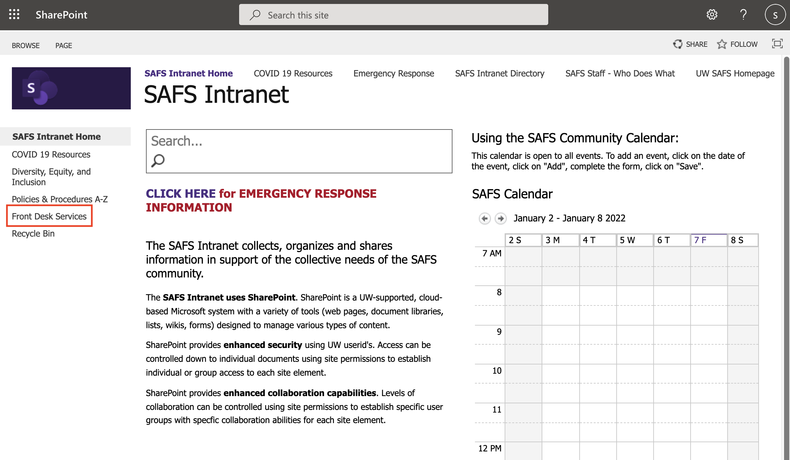
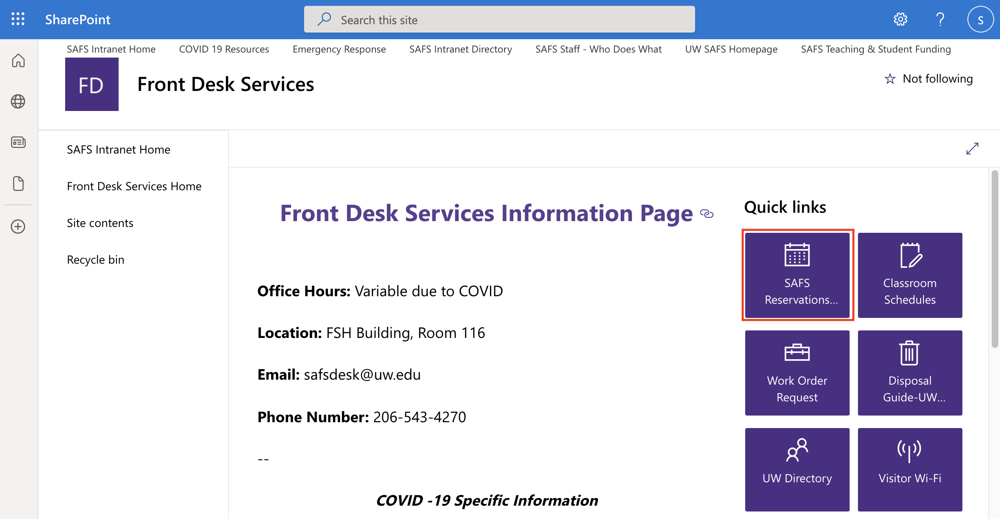
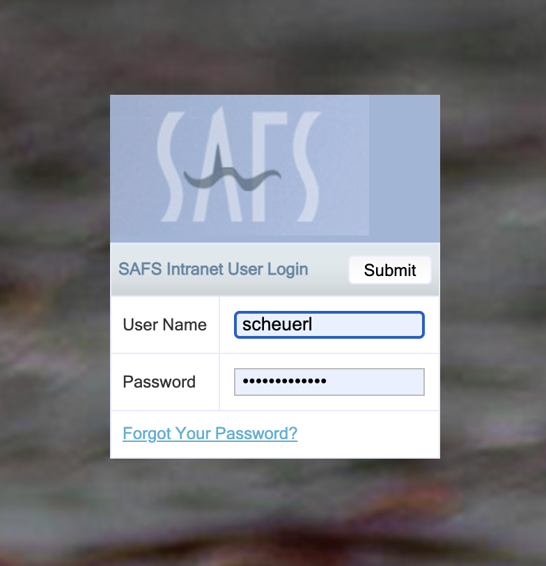
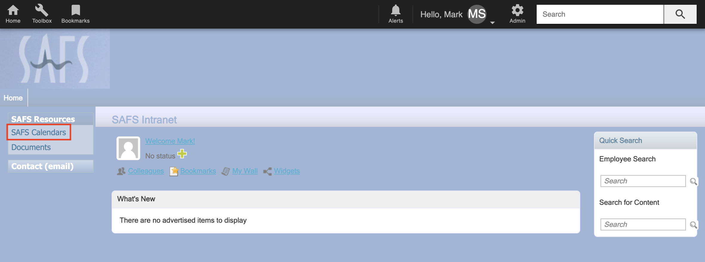
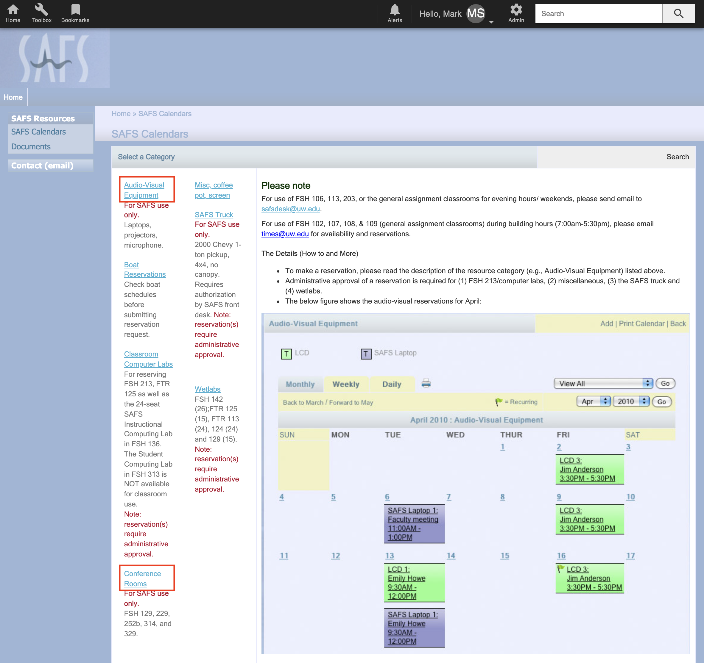

# Rooms & projectors

 

There are several conference rooms in the Fisheries Science Building that can be reserved for small meetings, as well as a portable LCD projector. Here are the steps to do so.

* Navigate to the [SAFS homepage](https://fish.uw.edu/) and click on the "Intranet" link in the upper right

{width=100%}

 

* Click on the link on the far left that says "Front Desk Services"

{width=100%}

 

* Click on the purple square on the right that says "SAFS Reservations..."

{width=100%}

 

* Enter your UW netID and password in the dialogue box

{width=75%}

 

* Click on the "SAFS Calendars" link on the far left

{width=100%}

 

* You will then see several light blue titles/links for equipment, boats, rooms, etc; click on the one you want

{width=100%}

